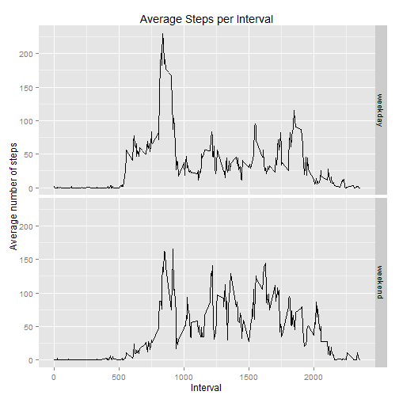

Reproducible Research: Peer Assessment 1
===========

## Loading and preprocessing the data


In this step raw data is read from the csv file. 

```r
# reading the raw data from CSV file  
data_source <- read.csv("activity.csv",header=TRUE)
```


Then the date field is transformed to date type.

```r
# transformaing the date field to date type
data_source$date <- as.Date(data_source$date)
```


## What is mean total number of steps taken per day?


```
## Loading required package: gsubfn
## Loading required package: proto
## Loading required package: RSQLite
## Loading required package: DBI
## Loading required package: RSQLite.extfuns
```

First the total number of steps taken per day is computed by omitting the rows with missing values (i.e., steps). 


```r
data <- na.omit(data_source)

data_steps_per_day <- sqldf("select date, sum(steps) steps from data group by date")
```

```
## Loading required package: tcltk
```


Then a histogram of this data is plotted and the mean and median of this dataset are computed.


```r
library(ggplot2)

g <- ggplot(data_steps_per_day, aes(x=steps))
g <- g + geom_histogram(fill="white",colour="black")
g
```

```
## stat_bin: binwidth defaulted to range/30. Use 'binwidth = x' to adjust this.
```

 

```r
round(mean(data_steps_per_day$steps))
```

```
## [1] 10766
```

```r
round(median(data_steps_per_day$steps))
```

```
## [1] 10765
```


## What is the average daily activity pattern?

To discover the daily activity pattern, the average number of steps for each interval accross all days are calculated at first. 

```r
data_avg_steps_per_interval <- sqldf("select interval, avg(steps) steps from data group by interval") 
```


Then the time series is plotted and the interval with the maximum number of steps is identified.  

```r
library(ggplot2)

max_interval <- sqldf("select interval, max(steps) steps from data_avg_steps_per_interval") 

g <- ggplot(data_avg_steps_per_interval, aes(x=interval,y=steps))
g <- g + geom_line()
#g <- g + geom_vline(xintercept = max_interval$interval, col="red", size=1)
g <- g + labs(title="Average Steps per Interval")
g <- g + labs(x="Interval")
g <- g + labs(y="Average number of steps")
g
```

 

```r
max_interval
```

```
##   interval steps
## 1      835   206
```


## Imputing missing values


Computing the total number of missing values in the dataset:


```r
data_source_new <- data_source

nrow(data_source_new[is.na(data_source_new$steps),])
```

```
## [1] 2304
```

```r
#head(data_source_new)
```

Implementing the strategy for filling in all of the missing values in the dataset by using the average number of steps in the corresponding interval and a new dataset is constructed. Then a histogram of the total number of steps taken each day is plotted.  

```r
for (i in 1:nrow(data_avg_steps_per_interval) ) {
  missing_steps <- data_avg_steps_per_interval$steps[i]
  missing_interval <- data_avg_steps_per_interval$interval[i]

  missing_rows <- is.na(data_source_new$steps) & data_source_new$interval == missing_interval
  
  data_source_new[missing_rows,]$steps = missing_steps
}

#head(data_source_new)

#nrow(data_source_new[is.na(data_source_new$steps),])

data_steps_per_day_new <- sqldf("select date, sum(steps) steps from data_source_new group by date")

library(ggplot2)

g <- ggplot(data_steps_per_day_new, aes(x=steps))
g <- g + geom_histogram(fill="white",colour="black")
g
```

```
## stat_bin: binwidth defaulted to range/30. Use 'binwidth = x' to adjust this.
```

 

Finally, the mean and median total number of steps taken per day is calculated. These values differ from the estimates from the first part of the assignment.
Imputing missing data has increased the total daily number of steps as well as the mean. 


```r
round(mean(data_steps_per_day_new$steps))
```

```
## [1] 10750
```

```r
round(median(data_steps_per_day_new$steps))
```

```
## [1] 10641
```


## Are there differences in activity patterns between weekdays and weekends?
In the new dataset (missing values filled in) a new factor variable is creaded with two levels - "weekday" and "weekend" indicating whether a given date is a weekday or weekend day.


```r
data_source_new$day <- ifelse(weekdays(data_source_new$date) == "Saturday" | weekdays(data_source_new$date) == "Sunday","weekend", "weekday")
data_source_new$day <- as.factor(data_source_new$day)
#str(data_source_new)
```

Now the daily activity pattern is plotted separately for weendays and weekends. 


```r
library(ggplot2)

data_avg_steps_per_interval_new <- sqldf("select interval, day, avg(steps) steps from data_source_new group by interval, day") 

g <- ggplot(data_avg_steps_per_interval_new, aes(x=interval,y=steps))
g <- g + geom_line()
g <- g + facet_grid(day ~ .)
g <- g + labs(title="Average Steps per Interval")
g <- g + labs(x="Interval")
g <- g + labs(y="Average number of steps")
g
```

 

These activity patterns clearly show the obvious difference between weekdays and weekends. During weekdays, more steps are taken in the early morning and then some steps are taken around the lunch time and later in the afternoon. In contrast to that, during weekends, the early morning steps are lower than weekdays, however, throughout the day, the number of steps are higher than corresponding intervals during weekdays.      


